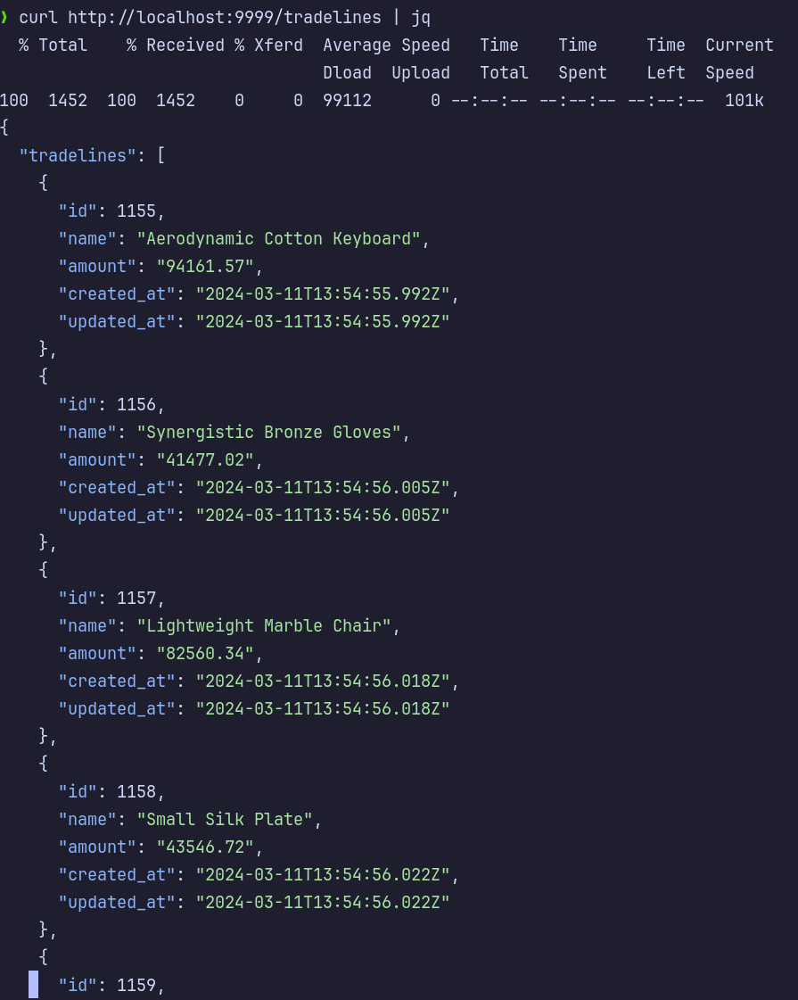
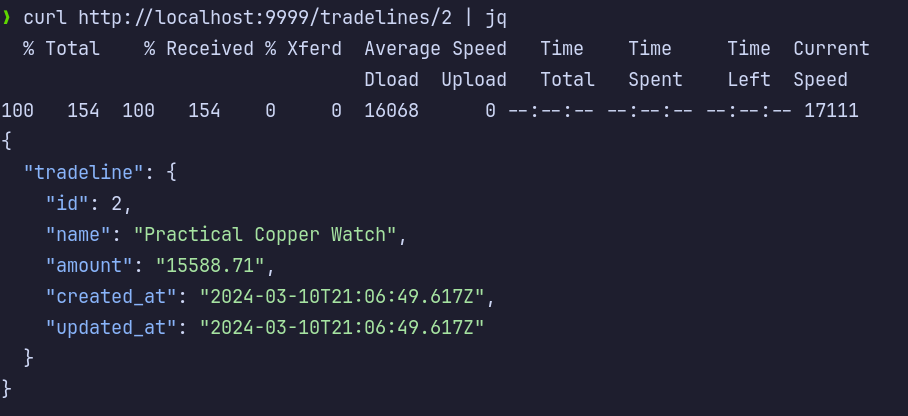
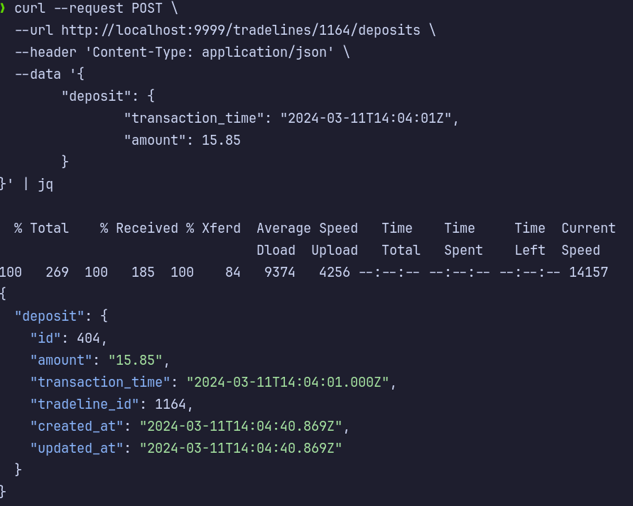

# Deposits Exercise


## Requirements

A tradeline on a credit report represents an account, such as a credit card or car loan.

In the codebase, the following exists:

* The `Tradeline` model, which can be used to store tradelines in the database.
* A `Tradeline` controller, which serves both the `index` and `show` routes for tradelines.
* Basic `rspec` tests on the controller with a `tradeline` FactoryBot.

Add in the ability to create deposits for a specific tradeline using a JSON API call. You should store the deposit date (this is most likely a future date), and amount. Expose the outstanding balance for a given tradeline in the JSON output for `TradelinesController#show`, and `TradelinesController#index`. The oustanding balance should be calculated as the `amount` minus all of the deposit amounts.

In addition:

* A deposit should not be able to be created that exceeds the outstanding balance of a tradeline.
* You should return validation errors if a deposit cannot be created.
* Expose endpoints for seeing all deposits for a given tradeline, as well as seeing an individual deposit.

Feel free to add any gems to the `Gemfile`, and touch any of the existing code. For example, if you prefer to use PostgreSQL or MySQL over the included SQLite, or a serializer of your choice, please go ahead. This is not required, but you can be as creative as you want.

This exercise is purely API based, and will not have any frontend components. Please do not spend more than 3 hours on this.

## Setup
This repo requires `Docker` to run.
1. Clone the repo.
2. Run `docker-compose up --build` to build the `deposits_api` and `postgres` containers.
3. Run the database migrations `docker exec deposits_api rake db:migrate`
4. Seed the database with tradelines `docker exec deposits_api rake db:seed`
5. Add deposits!

## Usage

### Tradelines
Tradelines can be requested in the following manner with `cURL`:

`curl http://localhost:9999/tradelines`
Returns all tradelines in a non-paginated manner.


`curl http://localhost:9999/tradelines/2`
Returns a specific tradeline using an id.


### Deposits
Deposits can be created in the following manner with `cURL`:
```
curl --request POST \
  --url http://localhost:9999/tradelines/1164/deposits \
  --header 'Content-Type: application/json' \
  --data '{
	"deposit": {
		"transaction_time": "2024-03-10T21:22:01Z",
		"amount": 63068.85
	}
}'
```


#### Documentation on Deposits
Deposits takes a `deposit` object with two fields, `transaction_time` and `amount`.
`transaction_time` is the UTC datetime the deposit should take place. This datetime needs to be passed in the ISO8061 format. If it is before the tradeline creation date a `422` error will be returned. If the `transaction_time` is in the future the amount will not be applied to the tradeline.
`Amount` is the amount intended to be applied to the corresponding tradeline. If the `amount` is greater than the balance of the tradeline an `422` error will be returned. Otherwise, the amount will be subtracted from the tradeline balance.

### Tests
If you wish to run the tests you can run `docker exec -it deposits_api bundle exec rspec`
